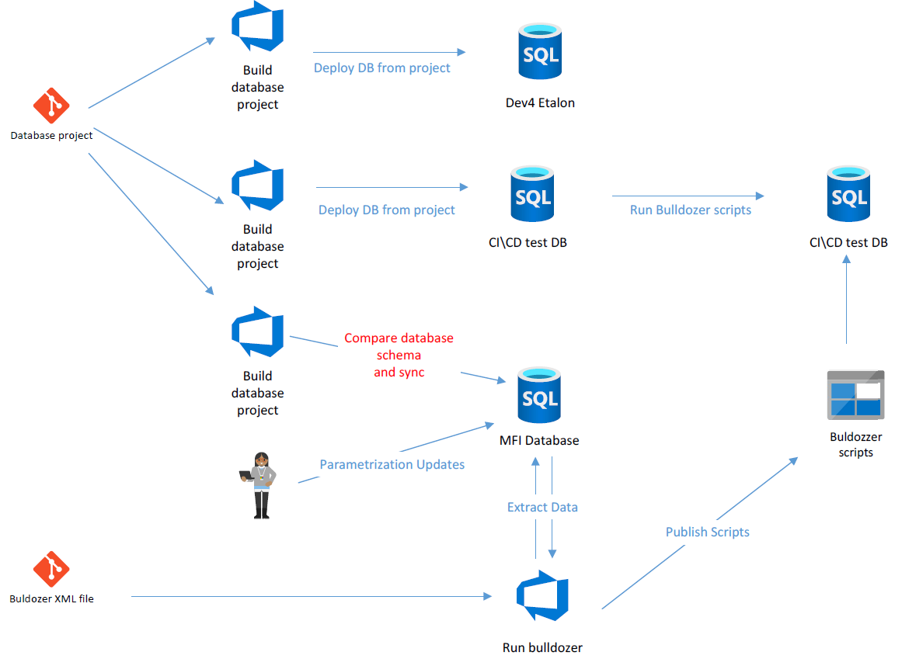

---
uid: cicd
title: CI\CD
---
### CI\CD
The app can be easily integrated in various CI\CD scenarios. However, for efficient usage it is recommeneded the following organization of develpoment process

1. One DB is selected as primary(or etalon DB) and whole parameterization is done there
2. The backup process must be established in order to minimize data lost
3. DB Project must be created and used to keep all data structure changes
4. According to project scope, packages for app to be created and maintained during project lifetime
5. DataExtraction to be frequent, once per day\week, to assure that packages work OK 
6. Deployment of DB to be frequent, once per day\week

Example, QWare project

 