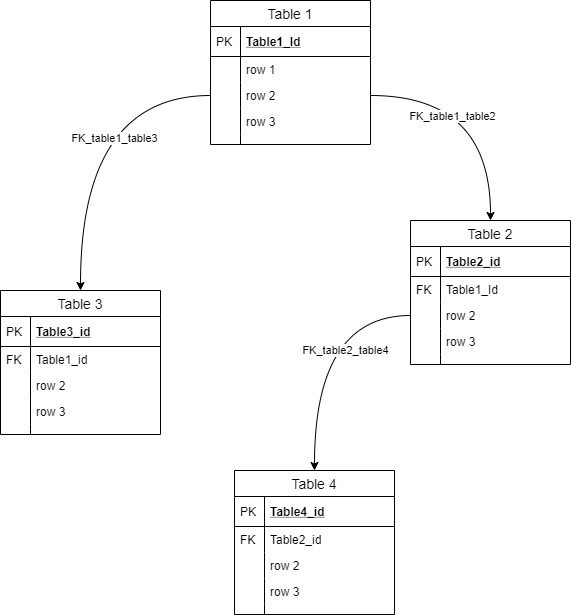
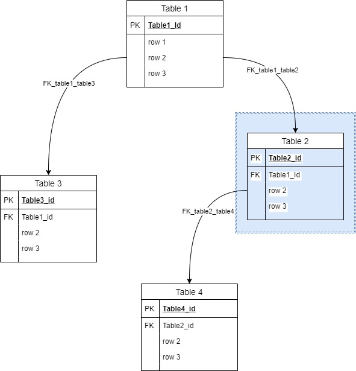
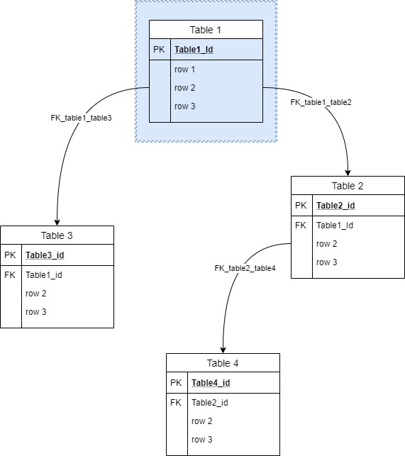

---
uid: extractor
title: The Extractor
---

## How Data Extractor works
The data in relation DB can be presented as graph where nodes are records in tables and foreign keys are links. 


> [!NOTE]
> It is important to understand parent\child relations.For example, in given figure, table1 is parent to table 2\3, and table 2 is child of table 1 and parent to table 4.

The **extraction** is a process of visiting the graph nodes, according to start records and given list of tables. Result of walking is list of dependent records in hierarchical structure, saved in memory. In general there are 4 possible **strategy** of walking from one table to another
- Moving to all children and all parents 
- Moving only to children 
- Moving only to parents
- Stop moving

For example 


Let imagine we are on table 2, highlighted with blue, the *walking* process can continue 
1. in both direction to table 1 and table 4 
2. only to parent, to table 1
3. only to child, to table 4
4. the process stop

in case strategy is 1 or 2 and if record has value in FK, process will be moved to table 1


and selection of the next step repeats for table 1, and so on.

Each table, included in the process, must have **extraction strategy** defined, if not the default from config file will be picked up. (see @configs)

### Summary
In order to extract data, the process needs to have 
1. starting *points* - records in DB, please see @usage, `RootRecords`
2. list of the tables to process, the tables **must be** explicitly listed among with **extraction strategy**, please check also @usage

the process takes record from starting ones, and *walking* from table to table according to given tables strategy.

## Extraction Strategy
Represented in xml in the following way 
```
        <ExtractStrategy xsi:type="OnlyChildrenExtractStrategy" ProcessChildren="true" ProcessParents="false" Where=""/>
        <ExtractStrategy xsi:type="FKDependencyExtractStrategy" ProcessChildren="true" ProcessParents="true" Where=""/>
        <ExtractStrategy xsi:type="OnlyParentExtractStrategy" ProcessChildren="false" ProcessParents="true" Where=""/>
        <ExtractStrategy xsi:type="OnlyOneTableExtractStrategy" ProcessChildren="false" ProcessParents="false" Where=""/>
```
### Where
`string` part of sql where statment, allows to limit records that will be considered when process selects next step to walk.  
```
    <ExtractStrategy xsi:type="OnlyOneTableExtractStrategy" ProcessChildren="false" ProcessParents="false" where=" id not in (1,2,3) ">
```