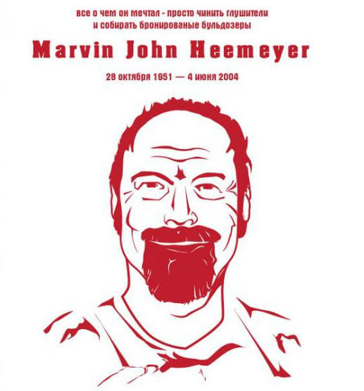

---
uid: intro
title: Introduction
---

The Buldozer application is a *CLI tool* to extraсt data from database and save it as `insert into` scripts. It was developed in order to simplify work of developer in preparation of the huge amount of parameterization scripts. The ultimate goal is to automatize creation of the SQL scripts in various scenarios

1. *Ad-hoc* needs, extract certain portions of parameters from DB
2. *CI\CD*, buldozer can be part of the automatic roll-out process, see more @cicd

Inspired by 

