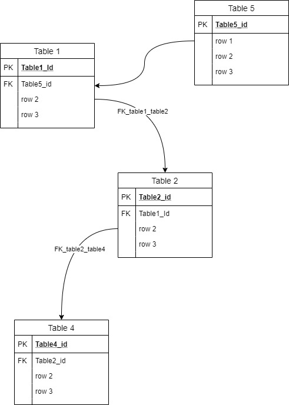

---
uid: sqlBuilder
title: The SQL Builder
---

## SQL Builder
Logical part of the application responsible to convert extract hierarchical data to SQL insert\update scripts

### Algorithm
Starting point records are presented as hierarchical list, each item has list of parent records and children records. The sql builder going item by item, and creates sql text according to specified SQL build strategy. 
> [!WARNING]
> Overall rule - *first process parents records, then children*. If extract strategy is not properyly defined for the tables, sql will be generated wrongly

Example 



Lets imagine starting point - *row 2* from *table 2*, and extraction process was done with `FKDependencyExtractStrategy`. Algorithm will be following

1. starting from parents, checking table 1 
2. record from *table 1* has also parent recods in *table 5*, so moving there
3. checking *table 5*, and generate sql according to Sql Build Strategy
4. moving back to *table 1* and generate sql, considering record from *table 5*
5. moving back to *table 2* and generate sql, considering record from *table 1*
6. moving to table *table 4* and generate sql, considering record from *table 2*


### Unqiue Columns
Each table must have unique column(s) beside PK. The combination of columns **must** uniquely identify the record among others in the table. Unique columns are defined either globaly (see @configs ) or in TableToExtract (see @usage )
The unqiue colums combination is widly used in the sql scripts generation
* to check if such record exists, ``` if not exists (select ... where ...) ```
* to initialize variable that holds primary key of newly inserted record

### SQL Generation 
The sql is generated according ot SqlBuildStrategy that must be defined for each table 
```
 <SqlBuildStrategy ThrowExecptionIfNotExists="true" NoInserts="false" AsIsInserts="false" IdentityInsert="false" FieldsToExclude="" />
```
#### ThrowExecptionIfNotExists
if `true`, the following sql will be generated
```
    declare @TableID  
    if not exists(select * from table where [unique columns] )				
    begin
       insert ... 
       set TableID ... 
    end
    else
  		RAISERROR('Record from table with unique values can not be found', 16, 1) 
```
if `false`

```
    declare @TableID  
    if not exists(select * from table where [unique columns] )				
    begin
       insert ... 
       set TableID ... 
    end
    else
    begin
       update ...

       select TableID ...
       from Table
       where [unique columns]
    end
```

#### NoInserts
if `true`, insert\update will not be generated
```
    declare @TableID  
    if not exists(select * from table where [unique columns] )				
  		RAISERROR('Record from table with unique values can not be found', 16, 1) 
    declare @TableID  
    select TableID ...
    from Table
    where [unique columns]
```

#### AsIsInserts
if `true`, trigger will be disabled before processing the table

#### IdentityInsert
if `true`   SET IDENTITY_INSERT ON\OFF will be used before insert

#### FieldsToExclude
String with of the columns separated by spaces, to be exluded from processing, it may be useful if data strture of the source and destination DB is slightly different. 

#### DeleteExistingRecords
if `true` resulted script will call SP `deleter` that deletes all related records from all tables before insert. SP will be created in the begining of script and dropped at the end
